# Data analysis in R

## Introduction
Diabetes is a chronic condition that poses a significant health risk and is a leading cause of death in both developing and industrialized countries. In this study, dataset of diabetic and non-diabetic individuals is classified using multivariate data analysis techniques in R. Data is retrieved from data.mendeley.com/datasets/wj9rwkp9c2/1. The goal of this study is to classify the diabetic patients based on their biological variables, , using PCA (Principle Components Analysis) and clustering method.

## Material and methods:
### Data description:

Dataset contains 1000 observations and 12 variables obtained from physical examination. The data is divided into three categories: Diabetic (Y) with 837 samples, Non-Diabetic (N) with 103 samples, and Predicted Diabetic (P) with 53 samples. The predicted category indicates individuals who have high chance of developing diabetes in the future (if they do not take measures to address the problem). This means that their values are in between of non-diabetic individuals and diabetic patients. Overview of dataset:

| Variable                          | Description     |
|-----------------------------------|-----------------|
|Gender                             |F for females and M for male (recoded as 0 for F and 1 for M)  |
|Age                                |Age in years (ranging from 20 – 79)    |
|Urea (High blood urea nitrogen)    |The amount of urea nitrogen in the blood (mmol/l)
|Cr	                                |Blood levels of chromium (mmol/l)
|HbA1c	                            |Average blood glucose (sugar) levels (mmol/l) in the last 2 – 3 months
|Chol	                            |Fast Cholesterol levels (mmol/l)
|TG	                                |Concentration Tri Glycoside Levels (mmol/l)
|HDL	                            |High-Density Lipoprotein (mmol/l)
|LDL	                            |Low-Density Lipoprotein (mmol/l)
|VLDL	                            |Very Low-Density Lipoprotein (mmol/l)
|BMI	                            |Body Mass Index (Weight in kg / (Height in m)2)
|CLASS	                            |Y (yes) for diabetes, N (no) for non-diabetes, P (predicted) as for patients who have high potential to have diabetes.

### Data preprocessing:

Data after being parsed into R will be pre-processed. The first two columns indicated patients ID and are quite messed up, thus, are removed. Data is checked for missing values, which shows that there is no missing value in the dataset. Then, correlation matrix is stored as a data frame.

Code snippset:
        
        Dia_data <- read.table("Dataset of Diabetes.csv",sep=',', header=T)
        Dia1 <- Dia_data[, 3:14]                        #Skipping the first 2 id_columns
        Dia1$Gender <- ifelse(Dia1$Gender == "M", 0, 1) #Convert "Gender" column to 0 and 1
        Dia1$CLASS <- trimws(Dia1$CLASS)                #Trimming all space characters in CLASS column
        attach(Dia1)
        #PREPROCESSING
        any(is.na(Dia1)) #Checking for missing values
        sum(is.na(Dia1)) #There is no missing values
        predict_CLASS <- Dia1[CLASS=="P", ] #Storing subset values
        summary(Dia1)
        dim(Dia1)
        corr_matrix <- cor(Dia1[, 1:11]) #Correlation matrix

### Data Visualization:

We can see the similarities between diabetic classes in the distribution of some variables, like Urea, Cr or lipoprotein density (HDL, LDL, VLDL).  If we consider all variables (Andrew plot), we can see the similarity in shape of the curve, indicating similarity in (most of) the datapoints. The bottom right plot shows how each pair of 2 variables correlating to each other.

        Dia1$CLASS <- factor(CLASS)
        attach(Dia1)
        Dia2 <- Dia1[, 1:11]
        var_names <- names(Dia2)
        plots <- list()

|Scatter plot: | Code Snippset |
|----------------------|---------------|
|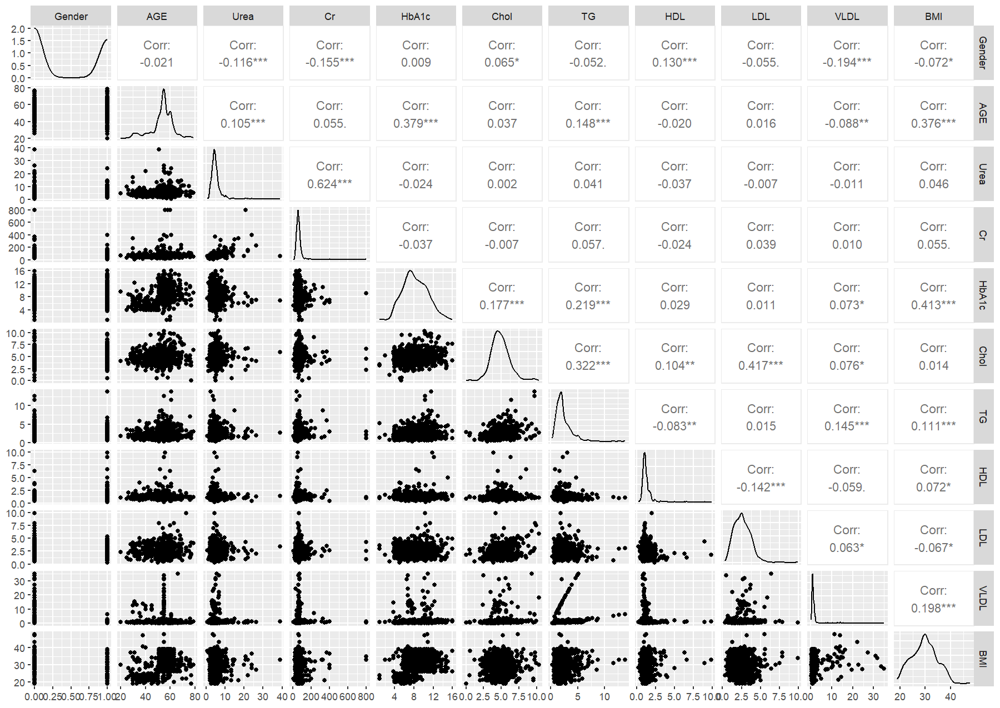 | #Pairwise plot for each variable (except for the dependent variable CLASS)  `Dia1_numeric <- apply(Dia1[, 1:11], 2, as.numeric)`   `ggpairs(data.frame(Dia1_numeric),main='Paired scatterplots of dataset')`   #Take a few seconds|

|Density plot: | |
|----------------------|---------------|
|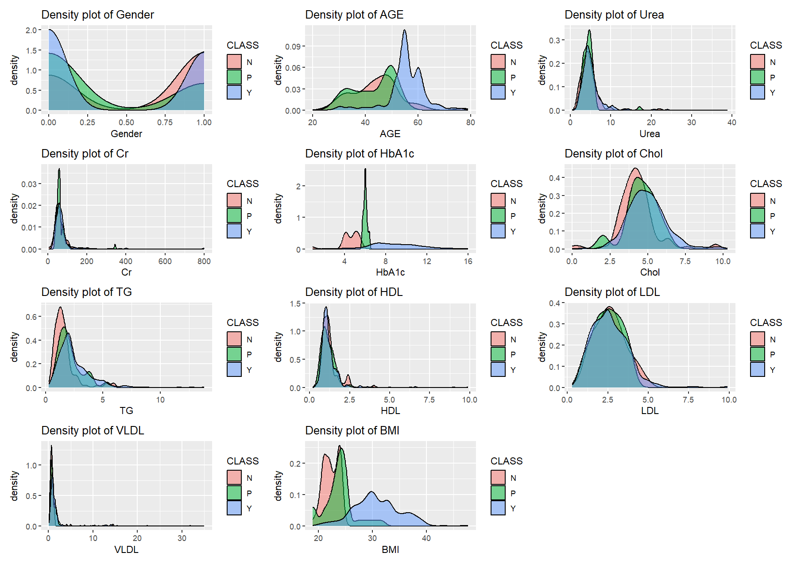 | #Density plots   `for (var_name in names(Dia2)) {`   `p <- ggplot(Dia2, aes(x = .data[[var_name]], fill = CLASS)) +`   `geom_density(alpha = 0.5) +`   `labs(title = paste("Density plot of", var_name))`   `plots[[var_name]] <- p` #Store the plot in the list   `}`   `wrap_plots(plots, ncol = 3)`|

|Andrew plot: | |
|----------------------|---------------|
|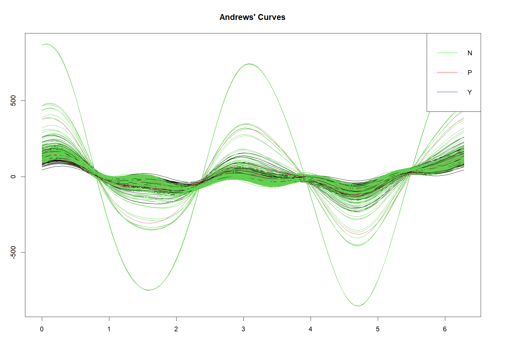 | #AndrewPlot   `andrewsplot(Dia1_numeric, f=Dia1$CLASS, style = "cart")`   `legend("topright", legend = unique(CLASS),  col = c("green", "red", "blue"),lty=1)`|

### PCA analysis and clustering

Data was standardized before continuing with PCA analysis with package “FactoMineR”, followed by hierarchical clustering. Two approaches of clustering were carried out: clustering based on PCA result (HCPC function) and clustering using the data directly (hcut function). The clusters predicted by clustering algorithms were compared to the real classification in the CLASS variable column for quality assessment, using confusion matrix.

#### <u>Standardization:</u>
        standardize_func <- function(x)
        { z <- (x - mean(x)) / sd(x) 
        return( z)} 
        Dia_Z <- apply(Dia1[1:11], 2, standardize_func)

#### <u>PCA Analysis</u>
        Dia_PCA <- PCA(Dia_Z, graph=T)        #Dia_Z already standardized
        Dia.hcpc$desc.var

This checks whether each variable is significant or non-significant towards the clusters:

Link between the cluster variable and the quantitative variables:

|       |  Eta2   |    P-value|
|-------|---------|-----------|
|Cr     |0.493263853| 6.819768e-148|
|Urea   |0.484838513| 2.533839e-144|
|AGE    |0.470569916| 2.082547e-138|
|BMI    |0.451048796| 1.437376e-130|
|HbA1c  |0.380388990| 2.351714e-104|
|TG     |0.031560951|  1.140349e-07|
|Gender |0.013093721|  1.401336e-03|
|VLDL   |0.006678345|  3.542556e-02|

This also gives the 2 plots:

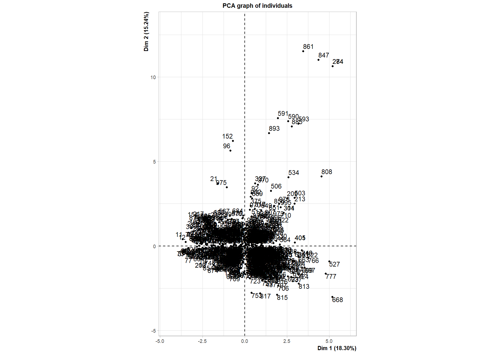         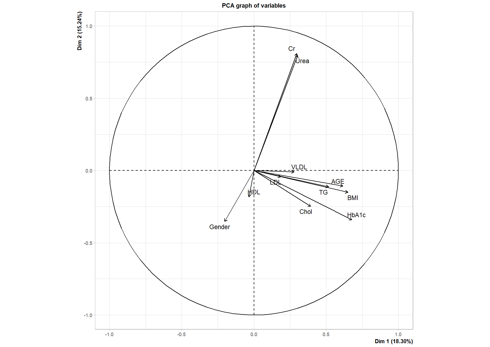

#### <u>Clustering</u>

        #Clustering on principle components
        Dia.hcpc<-HCPC(Dia_PCA,graph=TRUE, nb.clust=3)

This gives the 2 plots:

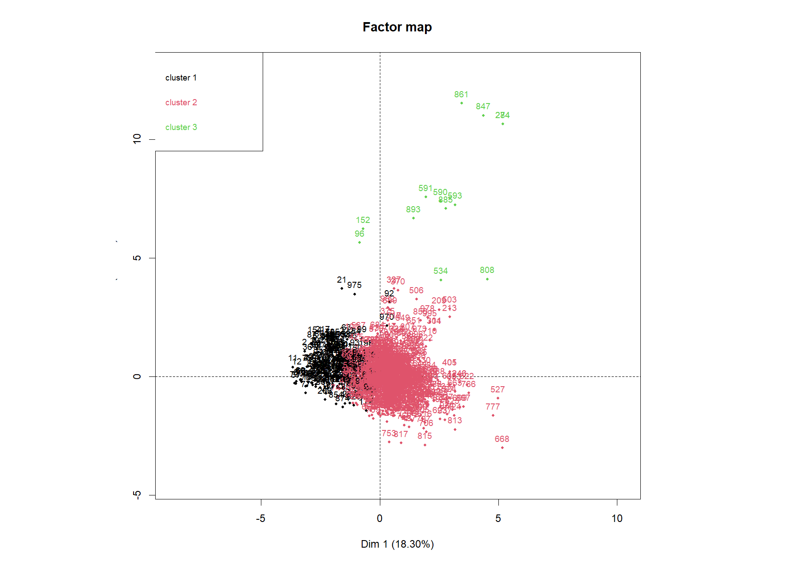      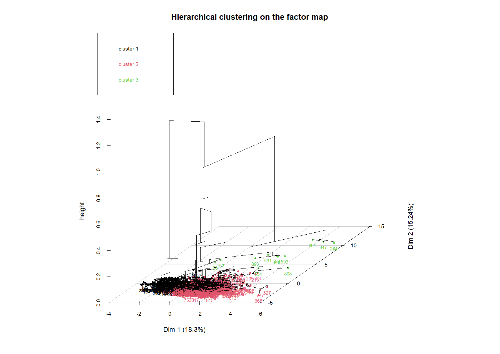 

        
        cluster <- data.frame(Dia.hcpc$data.clust)
        cluster %>% group_by(clust) %>% summarize(Patients_count = n())
        df = data.frame(Dia.hcpc$call$X)
        ggplot(df, aes(Dim.1, Dim.2))+geom_point(aes(col = clust))+theme_bw()+
        stat_ellipse(geom="polygon", aes(fill = clust), alpha = 0.2, show.legend = F)

        #Clustering directly on data
        Dia_tree <- hcut(Dia1[, 1:11], k = 3, stand = TRUE)

        #Comparing cluster and real data CLASS (diabetic classification)
        cluster$id <- 1:nrow(cluster)
        Dia1$id <- 1:nrow(Dia1)
        result <- inner_join(cluster, Dia1, by = "id") %>%
        select(id, CLASS, clust)

        result <- result %>%
        mutate(presicted_value = recode(clust, "1"= "N", "3" = "P", "2" = "Y"))
        confusion <- confusionMatrix(data=factor(result$presicted_value), reference =
                                    factor(result$CLASS))
        confusion

## Result and Discussion

### PCA Analysis result:

The graphical result of variables dimensionality reduction using PCA, where vector variables are converted into another direction based on their variances. The first figure also shows the variances contribution, with colour red having large variances and blue being smallest variances. The second figure shows how the observations distributed in the 2 PCs dimension. The eclipse covers 95% of the observations in each diabetic group.

|Principle components 1 vs 2 of each variable: | Code Snippset|
|----------------------|---------------|
|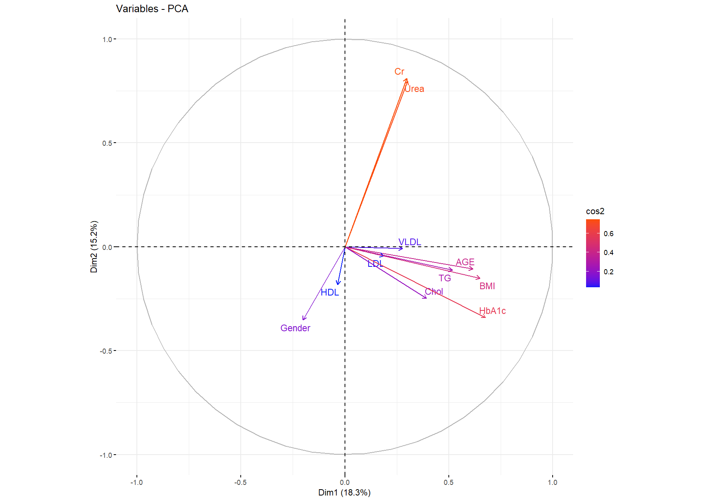 | `fviz_pca_var(Dia_PCA, col.var = "cos2",`   `gradient.cols = c("#0018F9", "#FC4E07"), repel = TRUE)`|

|PCA Biplot: | Code Snippset|
|----------------------|---------------|
|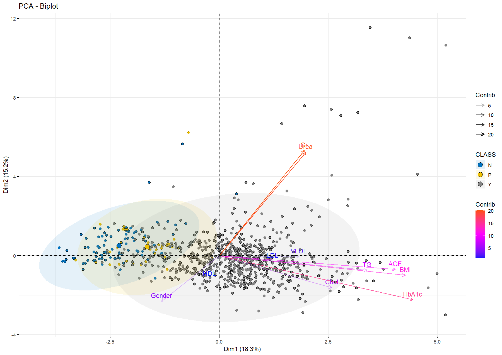 | `fviz_pca_biplot(Dia_PCA, `   # Individuals   `geom.ind = "point",`   `fill.ind = Dia1$CLASS, col.ind = "black",`   `pointshape = 21, pointsize = 2,`   `palette = "jco",`   `addEllipses = TRUE,`   # Variables   `alpha.var ="contrib", col.var = "contrib",`   `gradient.cols = c("#0018F9", "#FF00FF", "#FC4E07"),`    `legend.title = list(fill = "CLASS", color = "Contrib",`   `alpha = "Contrib"))`|

Urea and Cr variables are positively correlated with each other with very high variances, indicating these 2 variables describe data the most. Moreover, these two vectors are seemed to perpendicular to HbA1c vector (also in red), indicating that Urea and Cr are independent of HbA1c. In other words, the level of chromium and urea nitrogen in blood can be measured independently from the glucose level (or vice versa) to assess diabetic patients.

Assessing the eigenvalues of all the components:

|PC1|	PC2|	PC3|	PC4|	PC5|	PC6|	PC7|	PC8|	PC9|	PC10|	PC11|
|---|------|-------|-------|-------|-------|-------|-------|-------|-------|--------|											
|eigenvalue|	2.012|	1.676|	1.485|	1.244|	1.039|	0.919|	0.770|	0.573|	0.501|	0.422|	0.3533|
|percentage of variance| 18.301|15.239|	13.505|	11.311|	9.452|	8.360|	7.004|	5.211|	4.558|	3.840|	3.2125|
|cumulative percentage of variance| 18.301| 33.541| 47.04| 58.359| 67.811| 76.171| 83.175| 88.387| 92.946| 96.787| 100.00|

According to Kaiser rule, PCs having eigenvalues > 1 are considered important (large contribution) in explaining the data.

        Eigen <- t(Dia_PCA$eig)
        eigen_Kaiser <- Eigen[,Eigen[1,] > 1]
        df <- data.frame(Dia_PCA$eig)

|Eigenvalues plot: | |
|----------------------|---------------|
|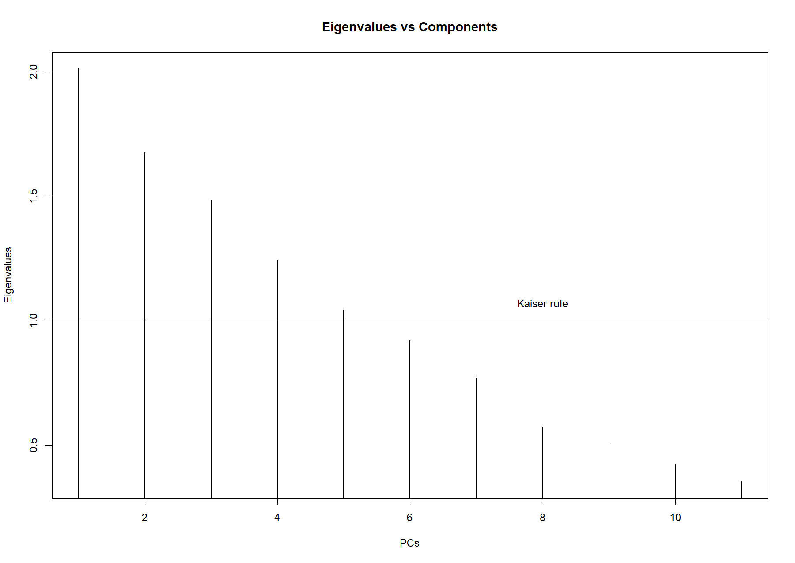 | `plot(df$eigenvalue, type = 'h', main = "Eigenvalues vs Components",`   `xlab = "PCs", ylab = "Eigenvalues", lwd=1.5)`   `abline(h=1.0)`   `text(8, 1.07, "Kaiser rule")`|

#### Others PCA plots

|PC1 vs PC2, grouped by patients type | |
|----------------------|---------------|
|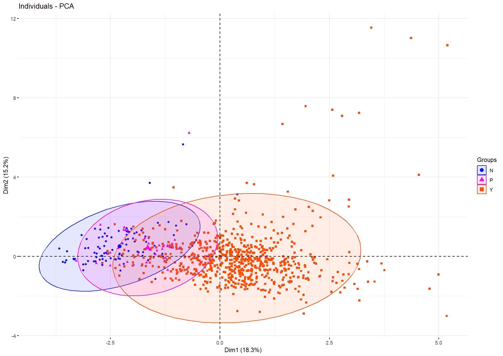 | `fviz_pca_ind(Dia_PCA,`   `geom.ind = "point", col.ind = Dia1$CLASS,`   `palette = c("#0018F9", "#FF00FF", "#FC4E07"), addEllipses = TRUE, `   `legend.title = "Groups")`|
|||

### Clustering result:

Assuming the data is distributed in 3 cluster corresponding to 3 diabetes classification, 3 for the number of clusters is filled in the clustering function. HCPC function is used to cluster data based on PCA result. In this study, only 2 dimensions are discussed, which explains 33.5% of data. 

        plot.HCPC(Dia.hcpc, choice = 'tree', ind.names = F)
        plot.HCPC(Dia.hcpc, axes = 1:2)

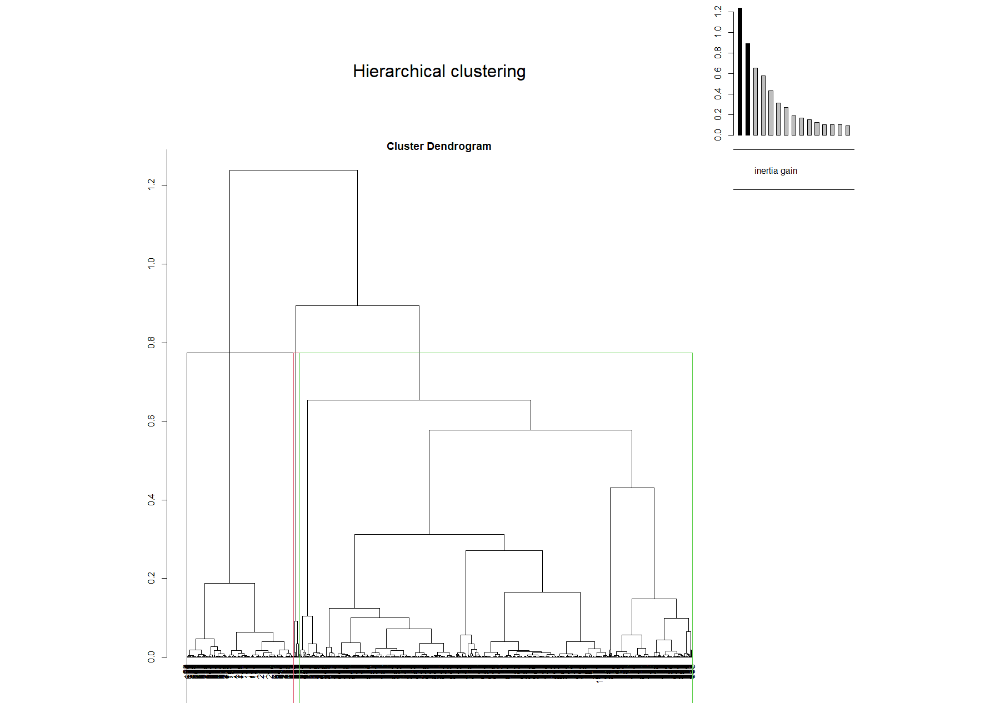                  

Comparing to clustering directly on the data, in this dataset, with 3 clusters, the two approaches give similar results.

        fviz_dend(Dia_tree, rect = TRUE,cex = 0.3,k_colors = "jco",tittle = "Lower",
                 ggtheme = theme_classic(), graph=T) #Take some time

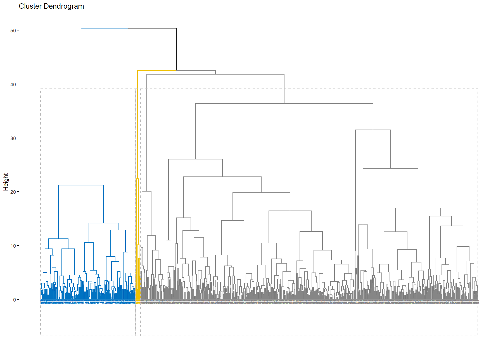 

### Comparing clustering and real data:

Plotting the 3 clusters onto the 3 classification variables.

        count_table <- table(result$CLASS, result$clust)
        count_table
        barplot(count_table,legend.text = TRUE, beside = TRUE,
                main = "Does clustering match real classification",
                xlab = "Cluster",
                ylab = "Counts", col=c("#66CCFF", "#6699FF", "#3366FF"))

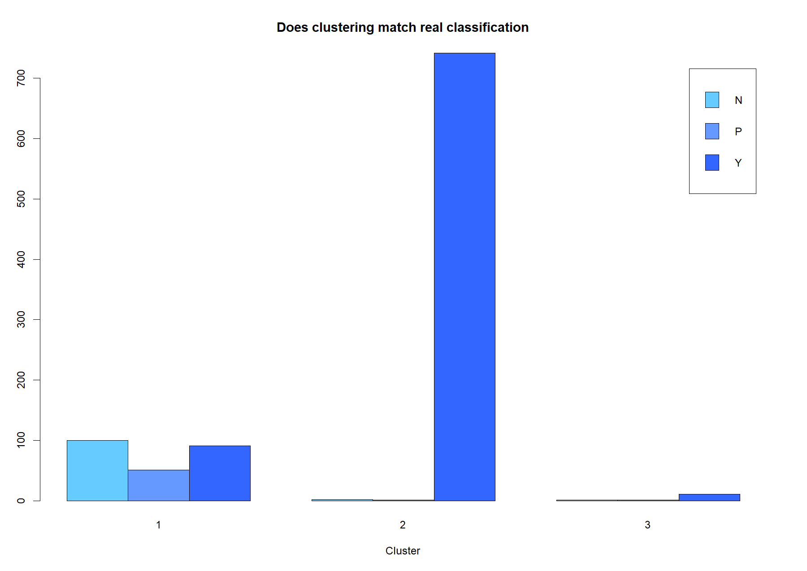 

We can approximately assign cluster 2 for diabetic patients (Y), 3 for predicted group, since it took the smallest portion in the data, thus, cluster 1 for non-diabetic patients. The confusion matrix is computed to check for false positive and false negative prediction.

Confusion matrix output:

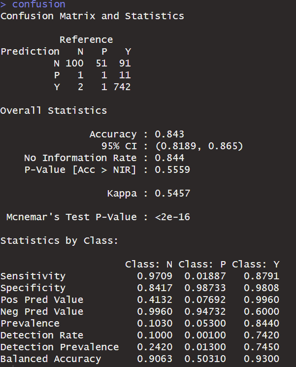

It seems that the prediction using clustering has high accuracy (84%). The Mcnemar’s p-value (<< 0.05) indicates a highly significant in difference between false positives and false negatives. Cluster 1 and 3 predicted correctly many individuals with the respective classification. But still, a large number of individuals having data lying between N and Y (predicted patients) would give a high uncertainty in clustering and lead to incorrect classification.

As a result, the sensitivity (true positive rate) of class N and class Y are particularly higher than that of class P. This is understandable, since PCA assumed that samples having large variances would contribute largely to explaining the data. Predicted individuals have value lies in between (nearer to the centre or mean), thus, low variances. This lead to incorrect predictions using PCA and clustering.

## Conclusion

Even though PCA has drawbacks in analysing variables having low variances, it is still a good technique to reduce the dimensions of data in further analysis. In this study, PCA has been used to classify diabetic patients.