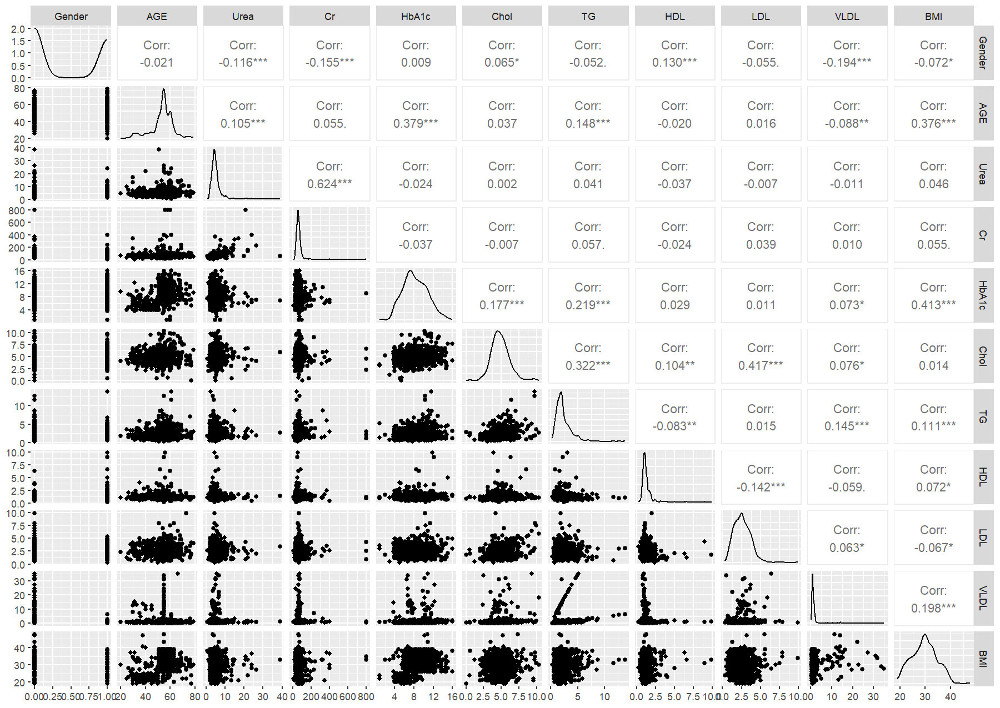

# Data analysis in R
---

## Introduction
Diabetes is a chronic condition that poses a significant health risk and is a leading cause of death in both developing and industrialized countries. In this study, dataset of diabetic and non-diabetic individuals is classified using multivariate data analysis techniques in R. Data is retrieved from data.mendeley.com/datasets/wj9rwkp9c2/1. The goal of this study is to classify the diabetic patients based on their biological variables, , using PCA (Principle Components Analysis) and clustering method.

## Material and methods:
### Data description:

Dataset contains 1000 observations and 12 variables obtained from physical examination. The data is divided into three categories: Diabetic (Y) with 837 samples, Non-Diabetic (N) with 103 samples, and Predicted Diabetic (P) with 53 samples. The predicted category indicates individuals who have high chance of developing diabetes in the future (if they do not take measures to address the problem). This means that their values are in between of non-diabetic individuals and diabetic patients. Overview of dataset:

| Variable                          | Description     |
|-----------------------------------|-----------------|
|Gender                             |F for females and M for male (recoded as 0 for F and 1 for M)  |
|Age                                |Age in years (ranging from 20 – 79)    |
|Urea (High blood urea nitrogen)    |The amount of urea nitrogen in the blood (mmol/l)
|Cr	                                |Blood levels of chromium (mmol/l)
|HbA1c	                            |Average blood glucose (sugar) levels (mmol/l) in the last 2 – 3 months
|Chol	                            |Fast Cholesterol levels (mmol/l)
|TG	                                |Concentration Tri Glycoside Levels (mmol/l)
|HDL	                            |High-Density Lipoprotein (mmol/l)
|LDL	                            |Low-Density Lipoprotein (mmol/l)
|VLDL	                            |Very Low-Density Lipoprotein (mmol/l)
|BMI	                            |Body Mass Index (Weight in kg / (Height in m)2)
|CLASS	                            |Y (yes) for diabetes, N (no) for non-diabetes, P (predicted) as for patients who have high potential to have diabetes.

### Data preprocessing:

Data after being parsed into R will be pre-processed. The first two columns indicated patients ID and are quite messed up, thus, are removed. Data is checked for missing values, which shows that there is no missing value in the dataset. Then, correlation matrix is stored as a data frame.

### Data Visualization:

We can see the similarities between diabetic classes in the distribution of some variables, like Urea, Cr or lipoprotein density (HDL, LDL, VLDL).  If we consider all variables (Andrew plot), we can see the similarity in shape of the curve, indicating similarity in (most of) the datapoints. The bottom right plot shows how each pair of 2 variables correlating to each other.

<u>Scatter plot:</u>

<u>Density plot:</u>

<u>Andrew plot:</u>

### PCA analysis and clustering

Data was standardized before continuing with PCA analysis with package “FactoMineR”, followed by hierarchical clustering. Two approaches of clustering were carried out: clustering based on PCA result (HCPC function) and clustering using the data directly (hcut function). The clusters predicted by clustering algorithms were compared to the real classification in the CLASS variable column for quality assessment, using confusion matrix.

## Result and Discussion

