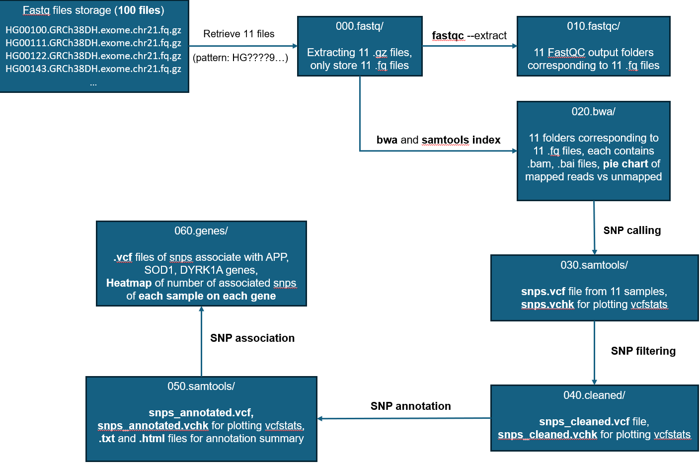
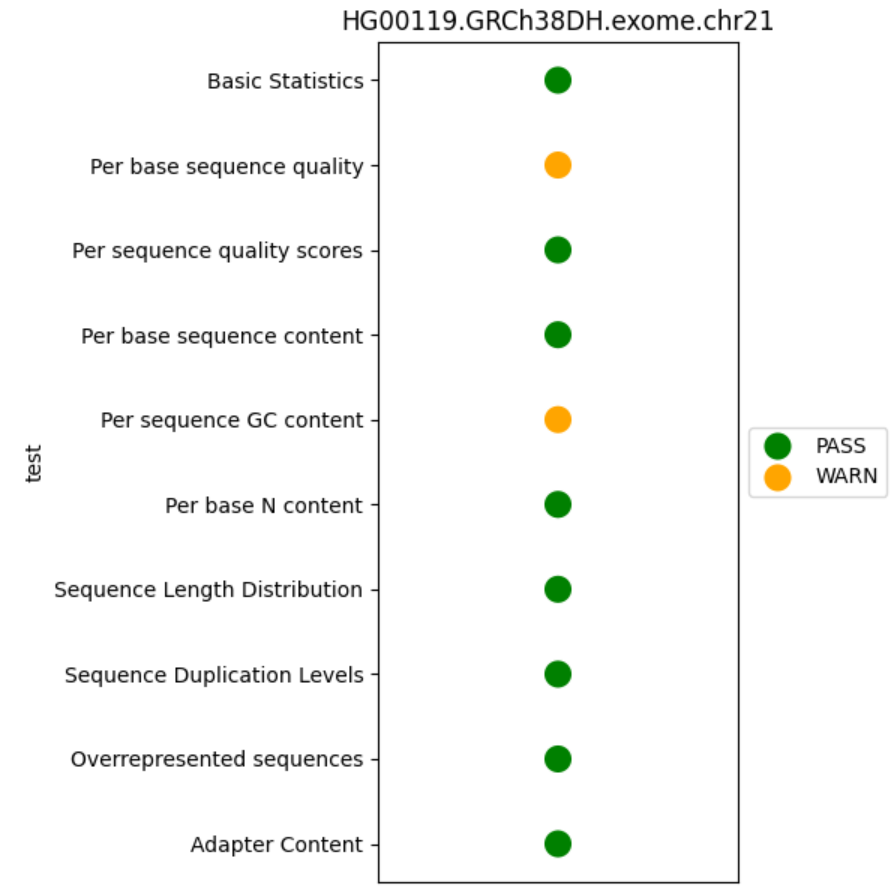
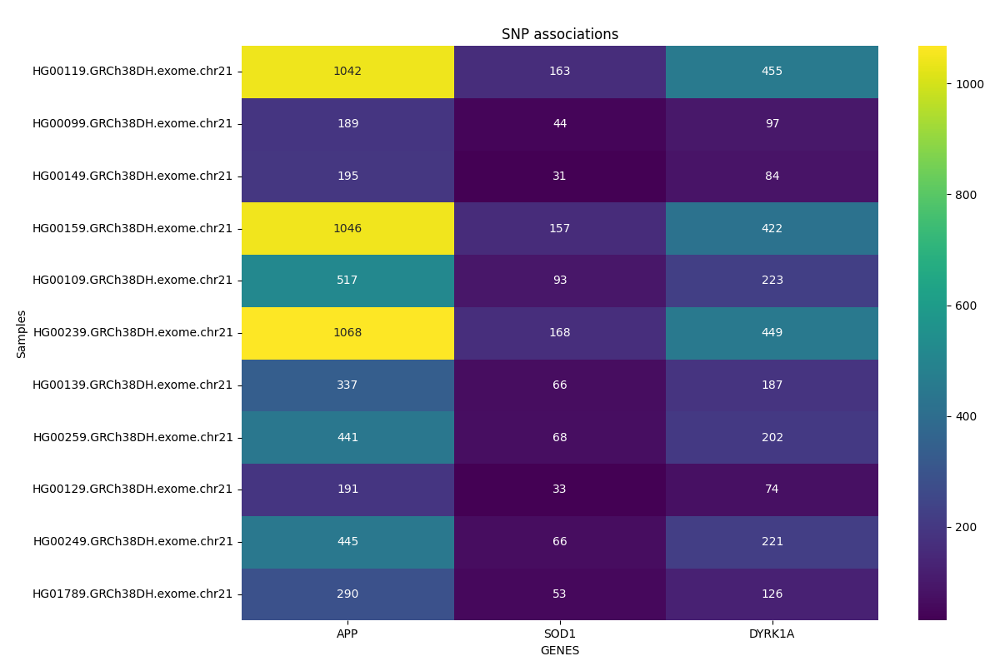

# SNP Calling Workflow

<i>Note that this project was running under KU Leuven server on super computer, thus, running the workflow without the correct configuration will result in errors</i>

## Introduction

This project implements a SNP calling workflow using Snakemake for a famous Alzheimer's disease research lab. The workflow is able to efficiently process large amounts of data. Furthermore, sources of sequencing data are not always reliable, so the workflow is able to handle or reject corrupt data and provide adequate logging of these events. 

APP (on chromosome 21) is a key gene in Alzheimer's research - it is the protein from which the peptide is cleaved that leads to Amyloid Beta aggregates. It is interesting to analyzes the SNPs in this genome. Additionally, it is also interesting in the genes SOD21 and DYRK1A.

The workflow make use of snakemake rule, as decribed below:

Each step is checked by plotting image report (<i>the code for plotting is written in Python</i>). All reports are stored in the <b>snake_report.html</b>

The `snakemake` command for running Snakefile and producing the report are implemented in a `.slurm` job file. Running the .slurm file with `sbatch` will run the Snakefile with snakemake. 

The final output folder 060.genes/ is uploaded but the other outputs are too large to be store on Github. Example of some image reports are given below.

## Output reports:

The fastqc gives the summary.txt for each sample, whether each step of checking quality is pass (green) or warn (yellow) or fail (red):

----
The `idxstats` of the .bam files can be viewed with `samtools idxstats`, which serves as an input for plotting mapped read vs unmapped read of each bam file:

------
SNP association heatmap, number of snps of each sample associates with each APP, SOD1, SYRK1A genes. The input of the heatmap is stored in `genes.vcf` file, after filtering the snps_annotated.vcf with `bcftoold view`. Detail code for plotting the map can be found in the Snakefile. All plots that are generate using snakemake rule can be found in the [snakemake report]().

