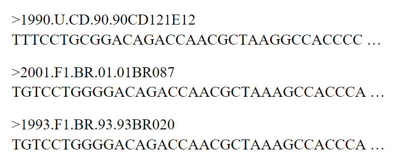

# Java Object-Oriented Programming with GUI (Eclipse IDE)

This project is my first big project working on OOP and Java GUI. There are still lack of flexibilities in the project, but will be improved in the future.
<i>(The detailed report for this project will be posted later)</i>

## Introduction

The goal is to implement the bioinformatics team that works together on a nucleotide multiple sequence alignment (MSA). The genome sequences (consisting of 4 possible nucleotides characters: A, C, G and T) of a collection of samples are investigated by first creating a multiple sequence alignment (essentially, putting the same positions within the virus’ genomes below one another). For each sequenced sample, the FASTA file contains 2 lines: first, the identifier (or name) of the sample (the lines that start with a ‘>’), followed by the corresponding genome sequence.

|Example of the 3 genome sequences:| SNiP alignment example:|
|----------------------------------|--------------------------------|
|| |

In this project, the FASTA file consists of 100 genomes, each of length 2500 nucleotides. The project is able to handle FASTA files of different dimension, i.e., with a different number of genomes and also with genomes (or the overall alignment) that are of different length.

Each of the alignment type supports these following operations:
- Search through the genomes for a specific sequence of characters (e.g., AACAAATG) and  return  the  corresponding identifiers for those genomes in which the sequence can be found.
* Replace a genome in the alignment with a new sequence (i.e., a genome that was previously not part of the alignment and that has a identifier that was not part of the initial FASTA file)
- In a given genome, replace all occurrences of a given sequence of characters by a new sequence of characters (without changing the total length of the genome)
* In the entire alignment, replace all occurrences of a given sequence of characters by a new sequence of characters (without changing the total length of the alignment) 
- Adding a genome with its corresponding identifier 
* Removing a genome, based on its identifier 

The bioinformatics team consists of a potentially large number of users that each have their own responsibilities and possible tasks they can perform. The .txt input file stores the information of the team, describing each team member by their function, first and last name , and years of experience in the team. The goal of the project is to apply is to construct a standard alignment for each bioinformatician to work on, based on the data in the provided .fasta file. 

The .fasta file also serves as the input to create the optimal alignment that is stored in a repository, which is initially identical to each of the bioinformaticians’ alignments.The repository also contains the SNiP alignment that always corresponds to the current version of the optimal alignment. Only the team lead(ers) and the technical support members have access to the repository.

The team lead(ers) and technical support can query the repository for each user’s personal alignment, but they cannot retrieve (nor directly access) the optimal alignment nor the SNiP alignment from the repository.

There are 3 types of member:
- Team  leader, who have direct access to a repository that contains the optimal alignment (with the lowest score), its corresponding SNiP alignment and the personal alignment of each bioinformatician, i.e., the team leader do not have their own alignment to work on but can select the alignment of any user to be promoted as the optimal alignment based on a simply ‘difference score’ criterion; the team leader are not able to retrieve the optimal alignment nor the corresponding SNiP alignment from the repository, but the alignment from each specific user can be retrieved.
* Bioinformaticians, who only have access to their own personal alignment (that can change over time due to editing operations), but not to the repository.
- Technical support, who have direct access to the same repository as the team leader; however, the functions of technical support members restrict themselves to backing up, restoring and removing / clearing the data in the repository.

The following functions / operations need to be provided for the bioinformaticians and the team leader, but not for the technical support crew: 
- write data to file: for bioinformaticians, this means writing their own personal alignment to an output text file, of which the name is simply their first name + their last name with a .alignment.txt extension; for team leader, this means writing all of the users’ alignments to one single file with the same naming convention 
* write a report to file: for bioinformaticians, this means writing the difference score (see below for more information) for their own personal alignment to an output text file, of which the name is simply their first name + their last name with a .score.txt extension; for team lead(ers), this means writing all of the users’ alignments scores to a file with the same naming convention 

The ‘difference score’ of an alignment is a simple metric to compute. Basically, using one of the genomes in the alignment as the reference genome (typically the first / top genome) and compute the number of different positions / characters of each other genome compared to that reference genome. Add up all of those numbers to obtain the difference score.

Function of each member:
|Member|Function|
|------|--------
|Bioinformatician| - Enable changes to the alignment, as listed above   - Retrieving the personal alignment (from that bioinformatician) |
|Team Leader|- Copy a user’s alignment to the optimal alignment in the repository (note that this will also affect the SNiP alignment); after this operation has been performed, changes to the user’s alignment do not affect the optimal alignment (nor the other way around)   - Overwrite a user’s alignment with the optimal alignment; after this operation has been performed, changes to the user’s alignment do not affect the optimal alignment (nor the other way around)|
|Technical Support|- Backup the repository data: a hard / deep copy of the current optimal alignment, its corresponding SNiP alignment and, for each user, their personal  alignment; whenever such a backup is made, the date and time of the backup procedure is stored as an instance variable for the technical support member   - Restore the repository data: reinstating the backup data, and hence overwriting the contents of the current optimal alignment, its corresponding SNiP alignment and, for each user, her/ his personal alignment   - Clearing the repository data: removing / emptying the current optimal standard alignment, its corresponding SNiP alignment and, for each user, her/ his personal alignment|

The goal of the application is to provide the opportunity for each bioinformatician to work on their own personal alignment independently, through the operations mentioned earlier in this document. As such, each bioinformatician starts off with a personal copy of the same initial standard alignment, which she/he can independently work on and make changes to. As different bioinformaticians perform different operations on their personal alignment, they can hence end up with different alignments during the course of their work. The initial alignment also serves as the initial optimal alignment in the repository and as a source for creating the initial SNiP alignment. None of the users, regardless of their function, is able to edit the optimal alignment(s) directly, as the optimal alignment can only be copied as a whole, as described above in the functions for the team lead(ers).

The input make use of the properties file. Such a properties file (typically named config.properties) only needs to contain two lines of key-value pairs: 
- teamfilename=team.txt 
- fastafilename=hiv.fasta

Thus, both input files should only be read in once at the start of the program.

## GUI output

In this project, GUI is also implemented for viewing the output.

<b>Panel 1 </b> is to show whether files have been loaded. 

- Clicking the "Load Input" button will show the information of the bioinformatics team from the .txt file.
- Clicking the "Next" button will jump to Panel 2.

|Panel 1 before|Panel 1 after|
|--------------|-------------|
|| |

<b>Panel 2 </b> is to show the SNiP alignment, checking whether the SNiP is converted correctly from the .fasta input

|Panel 2 before|Panel 2 after|
|--------------|-------------|
|| |

<b> Panel 3 </b> is to check if the function `replaceOccurences(String, String, String)` works. The idea is the replace a segment in 1 genome which is available in the .fasta file (based on their identifiers). The function will not run if the identifier does not match to any identifiers in the .fasta file.

- 3 input fields are for the genome identifier, to be replaced segment in that genome, new segment, respectively.
- Clicking on the "Replace Genome" button will replace this genome.
- Clicking on the "Export" button will export the new alignment to text file <i>(this export function is similar to the writeDataToFile() function of a bioinformatician)</i>
- Clicking the "Next" button will go back to Panel 1 and <b> save the text file after exporting </b> <i>(I'm not sure why, but I cannot save the file after exporting without clicking "Next")</i>.

|Panel 3 before|Panel 3 replacing|Panel 3 exporting|
|--------------|-------------|---------------------|
|| ||

<b>Checking the replaceGenome.txt after exporting: </b>  

## Main method

The main method was used to check whether the team members have the correct function.

<b>Main implementation:</b>

  

<b>Console result</b>

